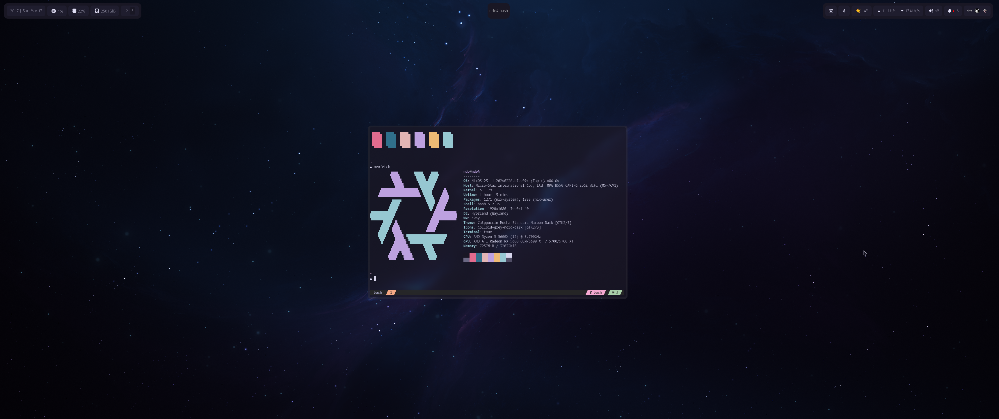

# NixOS Configs

## 🏗️Overview

This repository started off with my preexisting [dotfiles](https://github.com/ndom91/dotfiles) and I've since migrated almost all of that to declarative nix configuration files which you can find here!

## 🖥️ Hosts

|   Hostname  |       Motherboard        |         CPU            |  RAM  |        GPU          | Role | OS  | State |
| :---------: | :----------------------: | :--------------------: | :---: | :-----------------: | :--: | :-: | :---: |
| `ndo4`      | [MSI B550 Gaming]        |  [AMD Ryzen 5 5600X]   | 32GB  | [AMD Radeon 5600XT] | 🖥️   | ❄️   | ✅    |
| `ndo-gb`    | [Thinkpad X1 Carbon 12G] |  [Intel Ultra 7 155U]  | 32GB  | [Intel Xe]          | 💻️   | ❄️   | ✅    |
| `ndo2`      | [Huawei Matebook X Pro]  |  [Intel i5 8250U]      | 16GB  | [Intel UHD 620]     | 💻️   | ❄️   | ✅    |

## 📂 Directories

- `flake.nix` - Entrypoint
- `hosts/*` - Host specific configurations
- `modules/home-manager` - User applications, configuration, and packages
- `modules/nixos` - System-wide modules and configuration
- `packages` - Custom packages
- `dotfiles/*` - Various other not yet migrated to Nix configs, like `nvim`

## ☑️ Post Install

- [ ] Copy over SSH Keys
- [ ] Signin to 1Password
- [ ] Signin to Browser Sync (Vivaldi / Mozilla)
- [ ] Signin to Tailscale

## 🧑‍🏫 Inspiration

- [Wimpy's nix-config](https://github.com/wimpysworld/nix-config)
- [fufexan's dotfiles](https://github.com/fufexan/dotfiles)

## 📝 License

MIT

[MSI B550 Gaming]: https://www.msi.com/Motherboard/MPG-B550-GAMING-EDGE-WIFI
[Thinkpad X1 Carbon 12G]: https://www.lenovo.com/us/en/p/laptops/thinkpad/thinkpadx1/thinkpad-x1-carbon-gen-12-(14-inch-intel)/len101t0083
[Huawei Matebook X Pro]: https://consumer.huawei.com/en/laptops/matebook-x-pro-ultra-premium-edition/

[AMD Ryzen 5 5600X]: https://www.amd.com/en/products/processors/desktops/ryzen/5000-series/amd-ryzen-5-5600x.html
[Intel Ultra 7 155U]: https://ark.intel.com/content/www/de/de/ark/products/237327/intel-core-ultra-7-processor-155u-12m-cache-up-to-4-80-ghz.html
[Intel i5 8250U]: https://ark.intel.com/content/www/de/de/ark/products/124967/intel-core-i5-8250u-processor-6m-cache-up-to-3-40-ghz.html

[AMD Radeon 5600XT]: https://www.amd.com/en/products/specifications/compare/graphics/9021,9026
[Intel Xe]: https://www.intel.de/content/www/de/de/support/products/211012/graphics/processor-graphics/intel-iris-xe-graphics-family.html
[Intel UHD 620]: https://www.intel.de/content/www/de/de/support/products/126789/graphics/processor-graphics/intel-uhd-graphics-family/intel-uhd-graphics-620.html
